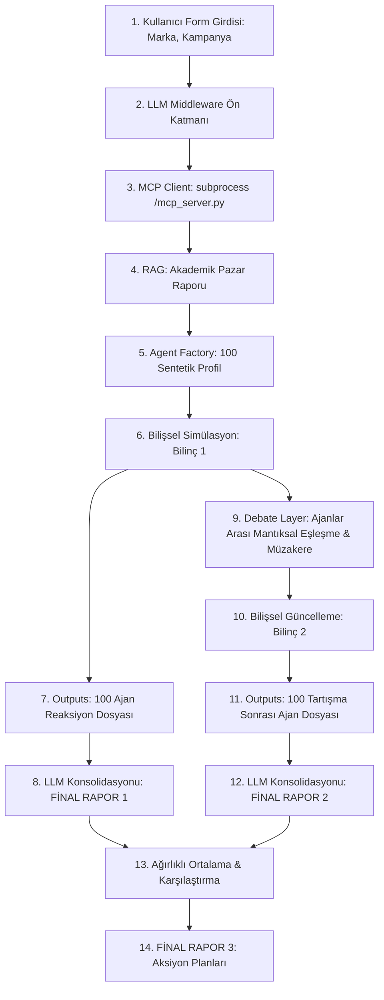

# 🔮 SENTETİK TÜKETİCİ ODAK GRUBU & MÜZAKERE MOTORU SİSTEM TASARIMI (SYSTEM DESIGN)

Bu kılavuz, **100-Agent Sentetik Odak Grubu ve Karar Müzakere Motorunun** teknik çalışma prensiplerini, içerdigi matematiksel formülleri ve gelecekte kurulacak olan Ön Arayüz (Frontend UI) ile nasıl entegre edileceğini (birleştirileceğini) hem yazılımcı geliştiriciler hem de **gelecekte bu projeyi devralacak yapay zeka ajanları (Antigravity)** için detaylıca açıklamaktadır.

---

## 1. GENEL SİSTEM MİMARİSİ VE AKIŞ (SYSTEM ARCHITECTURE)

Sistem, tekil tüketici kararlarını simüle etmekle kalmayıp, bu tüketicilerin akran diyalogları (peer debates) ile birbirlerinin fikirlerini etkilemesini ve bu iki aşamanın ağırlıklı ortalamasıyla nihai aksiyon planları üretmesini sağlayan 9 aşamalı bir boru hattıdır (conductor pipeline).



---

## 2. MODÜLLERİN GÖREVLERİ (COMPONENT ROLES)

### A) `llm_layer.py` (Zeka Ağ Geçidi)
*   **Görevi:** OpenAI veya Google Gemini modelleri ile güvenli iletişimi yönetir. `.env` dosyasındaki `API_PROVIDER` değişkenini okuyarak ilgili API'yi çağırır.
*   **Dayanıklılık (Failsafe):** API anahtarlarının eksik, geçersiz veya limit dışı olması durumunda sistemin çökmesini engellemek için pazar dinamiklerini ve diyalog yapılarını simüle eden **yüksek doğruluklu Türkçe yerel stokastik üreticiyi (fallback generator)** devreye sokar.

### B) `mcp_client.py` (Veri Alma Katmanı)
*   **Görevi:** Yerel makinede bulunan `/Users/onurataoral/tuik_veri/mcp_server.py` stdio tabanlı MCP sunucusunu bir `subprocess` olarak arka planda çalıştırır.
*   **İletişim Protokolü:** Sunucuyla `stdin` ve `stdout` üzerinden standart JSON-RPC 2.0 formatında haberleşir.
*   **Çekilen Veriler:** Bölgesel nüfus oranları, CPI enflasyon endeksleri, harcanabilir gelir indeksleri ve marka rekabet overlap (çakışma) değerleri.

### C) `agent_factory.py` (Matematiksel Profil Üretici)
*   **Görevi:** Raporlanan hedef kitle segment ağırlıklarını okuyarak (örn. %30 Metropol Çalışanı, %35 Geniş Aile) tam bu oranlarda **100 adet sentetik profil** üretir.
*   **Profil Detayları:** İsim-Soyisim, Yaş, Cinsiyet, Meslek, Şehir (İzmir, Muğla vb. bölgesel), MBTI karakter tipi, Harcanabilir Gelir, Karakter Alışkanlıkları ve 1-10 ölçeğinde duyarlılıklar (fiyat, çevre, sadakat).

### D) `simulation_engine.py` (Bilişsel Simülasyon Aşamaları)
Her ajanın kampanya fikrine vereceği tepki, rastgele üretilmez. 4 aşamalı bir bilişsel süreçten geçirilerek hesaplanır:

1.  **Dikkat Aşaması (Attention):** Ajanın reklamı görüp görmeme olasılığı.
2.  **Değer Rezonansı Aşaması (Resonance):** Kampanyanın sunduğu faydalar ile ajanın "Temel Değer Güdüsü" (Çevre, Statü, Tasarruf, Nostalji) arasındaki uyum.
3.  **İtiraz Aşaması (Objection):** Ajanın fiyat duyarlılığı ve gelir durumu karşısında kampanyanın fiyat endeksine (`price_index`) gösterdiği direnç.
4.  **Satın Alma Eğilimi (Purchase Likelihood):**
    $$Purchase\_Likelihood = Resonance \times 5.0 + (10.0 - Objection) \times 4.0 + Attention \times 10.0$$

---

## 3. AJANLAR ARASI MÜZAKERE VE FİKİR KAYMASI MATEMATİĞİ (DEBATE LAYER)

Sistemin en yenilikçi katmanı, tek başına karar veren ajanların akran etkileşimiyle fikirlerinin değişmesini simüle eden **Tartışma Katmanı (Debate Layer)**'dır:

1.  **Mantıksal Eşleştirme:** 100 ajan, kampanyaya verdikleri reaksiyonlara göre (en olumlu olandan en olumsuz olana doğru) sıralanır ve **çapraz zıt kutuplarla eşleştirilir** (En çok almak isteyen ile en sert eleştiren/kararsız kalan eşleşir).
2.  **3 Turluk Diyalog:** Eşleşen iki ajan, Türkçe dilinde bir tartışmaya girer:
    *   *1. Tur:* Kararsız/Olumsuz ajan şüphelerini ve finansal itirazlarını sunar.
    *   *2. Tur:* Satın alma eğilimi yüksek ajan, projenin toplumsal/çevresel faydasını veya uzun vadeli enflasyon koruması avantajını savunur.
    *   *3. Tur:* Karşılıklı argüman teatisinin ardından fikir alışverişi tamamlanır.
3.  **Bilişsel Kayma Hesaplaması (Stochastic Mind Shift):** Müzakere sonrasında tarafların satın alma eğilimleri karşılıklı ikna güçleri üzerinden güncellenir:
    *   *Olumlu Ajandan Olumsuza Kayma Etkisi:*
        $$\Delta A = (Likelihood_B - Likelihood_A) \times 0.25$$
    *   *Olumsuz Ajanın Finansal Direnç Etkisi:*
        $$\Delta B = (Likelihood_A - Likelihood_B) \times 0.15$$
    *   Bu kaymalar neticesinde ajanların nihai satın alma yüzdeleri ve kategorik kararları (`Kesin Alır`, `Şüpheyle Alır`, `Pas Geçer`, `Reddeder`) yeniden hesaplanıp `outputs/final_reactions/` dizinine ikinci bir dosya grubu olarak kaydedilir.

---

## 4. RAPORLAMA KATMANI VE FİNAL ÇIKTILARI

Süreç sonunda firmanın elinde 3 adet akademik düzeyde finalize edilmiş rapor kalır:
1.  **Rapor 1 (`report_1_initial.md`):** Tüketicilerin kampanyayla ilk karşılaştıklarındaki ham tepkilerini, segmentasyon reaksiyonlarını ve ilk itirazlarını analiz eden rapor.
2.  **Rapor 2 (`report_2_post_debate.md`):** Tüketicilerin toplumsal müzakerelere girdikten sonra ikna olanların oranını, hangi argümanın kimi ikna ettiğini ve değişen yüzdeleri ele alan rapor.
3.  **Rapor 3 (`report_3_final.md`):** İlk reaksiyon ile müzakere sonrası durumun ağırlıklı ortalama matrisini çıkaran, iki durum arasındaki farkları istatistiksel tablolarla kıyaslayan ve firma için **3 kesin aksiyon planı** sunan final strateji belgesi.

---

## 5. GELECEK ENTEGRASYON KILAVUZU (FRONTEND UI İLE BİRLEŞTİRME)

Gelecekte bu motorun üzerine bir Web UI (Next.js, React veya Streamlit) kurulmak istendiğinde, izlenmesi gereken adımlar şunlardır:

### 1. Giriş Verilerinin Toplanması (Input Payload)
UI üzerindeki formdan toplanacak veriler aşağıdaki JSON yapısında `pipeline.py` içerisindeki `FORM_INPUT` değişkenine aktarılmalıdır:
```json
{
  "brand_name": "Kullanıcı Girdisi",
  "campaign_title": "Kullanıcı Girdisi",
  "category": "Kahve / Tekstil / Gıda vb.",
  "price_index": 1.2, 
  "region": "Hedef Bölge (Ege, Marmara vb.)",
  "target_audience": "Hedef Kitle Açıklaması",
  "campaign_description": "Kampanyanın veya ürünün detaylı metni",
  "key_selling_points": "Özellik 1, Özellik 2, Özellik 3"
}
```

### 2. Motorun Tetiklenmesi (Triggering the Engine)
Boru hattını web üzerinden çalıştırmak için `pipeline.py` modülündeki `run_focus_group_pipeline()` fonksiyonu tetiklenmelidir. Bu fonksiyon:
- MCP bağlantısını kurar.
- `outputs/` dizinini temizler veya günceller.
- 100 sentetik ajan dosyasını stochastically oluşturup diske yazar.

### 3. Çıktıların Arayüzde Gösterilmesi (Displaying Outputs)
Arayüz, simülasyon tamamlandığında şu yollardan veriyi okumalıdır:
*   **Bireysel Profil İnceleme (Drill-Down Modal):** `outputs/initial_reactions/agent_agent_X.json` ve `outputs/final_reactions/agent_agent_X.json` dosyalarını okuyarak, seçilen ajanın profil kartını, diyalog ortağını ve diyalog sonrası yazdığı Türkçe kotasyonu arayüzde dinamik modallar halinde gösterebilir.
*   **Raporların Gösterimi:** `outputs/report_1_initial.md`, `outputs/report_2_post_debate.md` ve `outputs/report_3_final.md` dosyalarını okuyup markdown renderer aracılığıyla doğrudan ekrana basabilir.

---

*Not: Bu dosya, sistemin çalışma mantığını korumak ve geliştirmek üzere tasarlanmış teknik bir manifestodur.*
